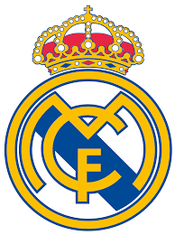

# My Homepage

## Who am I?
My name is *Ke Ou*. I am a senior **CSE** student at **_UCSD_**. 

## Hobbies
- Soccer 
  - My favorite team: ~~Barcelona~~ Real Madrid
    
- Video Games
- Traveling
  - My [destination](https://www.visitmexico.com/en/) for the winter break.
- Watching Films
  - My favorite quote: 
  > May the force be with you.
- Learning
  - My favorite programming langugage: `print('Hello, world!')`
  

## Top Three Things I Want to Learn From [CSE 110](https://github.com/ouke025/CSE110-Pages/blob/add-read-me2/index.md#week-1-assignments)
1. Tools Software Engineering uses in industry
2. Team work skills
3. Experiences with building complex softwares

## Week 1 Assignments
- [ ] Lab 1
  - [Here](README.md) is README.md for Lab 1.
- [x] Slack Sign-up
- [x] Prof Greeting
- [x] Survey 
- [ ] Individual Engineer Statement